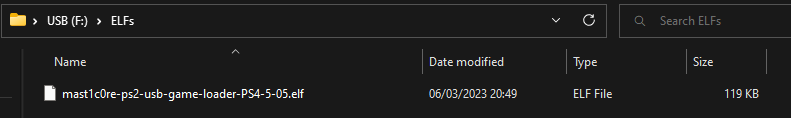

# mast1c0re - PS2 USB ELF Loader

Loads PS2 ELF files built with [mast1c0re](https://github.com/McCaulay/mast1c0re) from a USB. See the [samples/](https://github.com/McCaulay/mast1c0re-ps2-network-elf-loader/tree/master/samples) directory in the [mast1c0re-ps2-network-elf-loader](https://github.com/McCaulay/mast1c0re-ps2-network-elf-loader/) repository for example ELF projects.

It is recommended that you use the PS2 ELF loader save (network or usb) as you may be locked out of being able to copy files from your USB to the game after some time of being offline from PSN. Keeping the PS2 ELF save file, you can future proof the ability to run any ELF file without the need to copy game save files.

## Running the PS2 ELF Loader

You need to load the ELF loader by importing the VCM0.card file for your PS4 or PS5 firmware into an Okage: Shadow King game save. Then, you need to run the game and restore the save file to trigger the loader.

## Configuring a USB

The USB drive must be formatted with exFAT and MBR.

The USB root directory should contain a folder named "ELFs" which contains the ELF files ending in a ".elf" file extension.

## ELF Projects
* [PS2 Network Game Loader](https://github.com/McCaulay/mast1c0re-ps2-network-game-loader)
* [PS2 USB Game Loader](https://github.com/McCaulay/mast1c0re-ps2-usb-game-loader)

## Supported Systems & Firmware Versions
* PS4
  * 5.05
  * 6.72
  * 9.00
  * 10.01
  * 10.50
  * 10.70